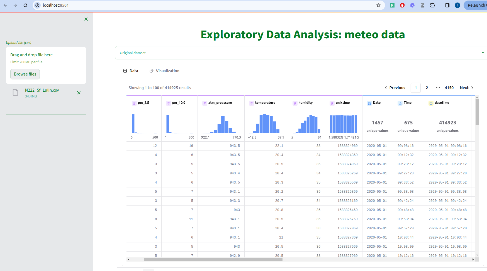
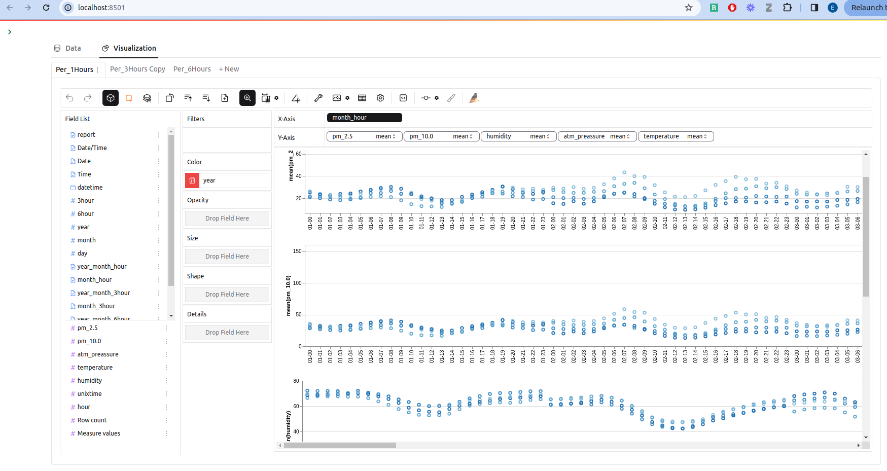
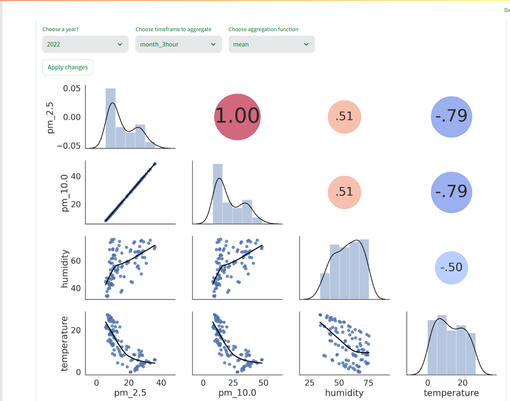

#  Exploratory data analysis of tabular data (CSV input) 

The data should contain at least the fileds: \
- _datatime_ (string or pandas datatime),
- _pm_2.5 (float)_, 
- _pm_10.0 (float)_, 
- _temperature(float)_, 
- _himidity(float)_  

**Example CSV input file from www.meter.ac is [_./data/N222_Sf_Lulin.CSV_](./data/N222_Sf_Lulin.CSV_).**

Fig 1. _Screenshots from the app_

<!--  -->

## Libraries
1. Data exploration and visualizationPyGWalker:  
    - [PyGWalker](https://github.com/Kanaries/pygwalker): a Tableau-like Python library for interactive explorator data analysis
2. For the front-end and web app development
    - [Streamlit](https://streamlit.io/): open-source Python based app framework suitable for Machine Learning and Data Science
3. For the project packaging part
    - [Poetry](https://python-poetry.org/)

## Instructions on how to setup and run the streamlit web app on Linux (Ubuntu)
For Windows and Mac the same should work 

1. Install Python _version 3.11_
2. Install [Poetry](https://python-poetry.org/docs/#installation) 
3. In a terminal go to the project directory and activate a python _virtual environment_ with: \
_poetry shell_
4. Run the command: \
_poetry install_
5. Run the command: \
_streamlit run streamlit.app_ \
and in a browser open: [http://localhost:8501/](http://localhost:8501/)

